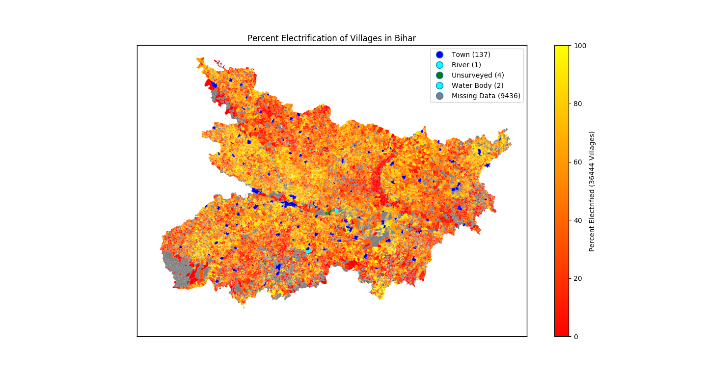

# Indian Village Dataset
## Data Overview
* Ground truth<br/>
```// village-level electrification rate from garv &```<br/>
```// village boundaries from the Datameet Program```
  * ElectrificationMap_Bihar.geojson




* Irrigation-electrification metrics<br/>
```// Naming convention: StateName(type)-VillageName-CensusID.tif```
  * Bihar(vil)-Aadharpur-227831.tif
  * ...
  * Bihar(vil)-Zorawarpur Patpar-238812.tif

* Binary village masks<br/>
```// Follows the same naming convention as the irr-elec metrics```
  * Bihar(vil)-Aadharpur-227831.tif
  * ...
  * Bihar(vil)-Zorawarpur Patpar-238812.tif

##### Temporary components
* __imagery_48b__ - 30m-resolution 48-band villages imagery (detailed below)
* __masks_res30__ - 30m-resolution village masks
* __imagery_res15__ - 15m-resolution RGB villages imagery (pan-sharpened)
* __imagery_b8__ - 15m-resolution Band#8 (the panchromatic band from the Landsat imagery)
* __masks_res15__ - 15m-resolution village masks


## Data Description
* __First 11 bands description:__ greenest cloud-free Landsat 8 imagery
<br/>For more information, see [Landsat 8 Handbook](https://landsat.usgs.gov/sites/default/files/documents/Landsat8DataUsersHandbook.pdf)

  B1: Coastal aerosol (0.43 - 0.45 µm)<br/>
  B2: Blue (0.45 - 0.51 µm)<br/>
  B3: Green (0.53 - 0.59 µm)<br/>
  B4: Red (0.64 - 0.67 µm)<br/>
  B5: Near Infrared (0.85 - 0.88 µm)<br/>
  B6: Short-wave Infrared 1 (1.57 - 1.65 µm)<br/>
  B7: Short-wave infrared 2 (2.11 - 2.29 µm)<br/>
  B8: Panchromatic (0.50 - 0.68 µm)<br/>
  B9: Cirrus (1.36 - 1.38 µm)<br/>
  B10: Thermal Infrared 1 (10.60 - 11.19 µm)<br/>
  B11: Thermal Infrared 2 (11.50 - 12.51 µm)<br/>


* __Table 1__ Irrigation-electrification bands (following the Landsat bands) description
<table>
  <tr>
    <th>Band index</th>
    <th>Description</th>
    <th>Time</th>
    <th>Source</th>
    <th>Computation</th>
  </tr>
  <tr>
    <td>12</td>
    <td rowspan="12">NDVI (Normalized Difference Vegetation Index)</td>
    <td>Jan 2016</td>
    <td rowspan="12">USGS Landsat 8 TOA Reflectance (Orthorectified)<br/>B4: Red (0.64 - 0.67 µm), B5: Near Infrared (0.85 - 0.88 µm)</td>
    <td rowspan="12">ndvi = image.normalizedDifference(['B5', 'B4'])</td>
  </tr>
  <tr>
    <td>13</td>
    <td>Feb 2016</td>
  </tr>
  <tr>
    <td>14</td>
    <td>Mar 2016</td>
  </tr>
  <tr>
    <td>15</td>
    <td>Apr 2016</td>
  </tr>
  <tr>
    <td>16</td>
    <td>May 2016</td>
  </tr>
  <tr>
    <td>17</td>
    <td>Jun 2016</td>
  </tr>
  <tr>
    <td>18</td>
    <td>Jul 2016</td>
  </tr>
  <tr>
    <td>19</td>
    <td>Aug 2016</td>
  </tr>
  <tr>
    <td>20</td>
    <td>Sept 2016</td>
  </tr>
  <tr>
    <td>21</td>
    <td>Oct 2016</td>
  </tr>
  <tr>
    <td>22</td>
    <td>Nov 2016</td>
  </tr>
  <tr>
    <td>23</td>
    <td>Dec 2016</td>
  </tr>
  <tr>
    <td>24</td>
    <td rowspan="12">Green Index</td>
    <td>Jan 2016</td>
    <td rowspan="12">USGS Landsat 8 TOA Reflectance (Orthorectified)<br/>B3: Green (0.53 - 0.59 µm), B5: Near Infrared (0.85 - 0.88 µm)</td>
    <td rowspan="12">green = image.select('B5').divide(image.select('B3'))</td>
  </tr>
  <tr>
    <td>25</td>
    <td>Feb 2016</td>
  </tr>
  <tr>
    <td>26</td>
    <td>Mar 2016</td>
  </tr>
  <tr>
    <td>27</td>
    <td>Apr 2016</td>
  </tr>
  <tr>
    <td>28</td>
    <td>May 2016</td>
  </tr>
  <tr>
    <td>29</td>
    <td>Jun 2016</td>
  </tr>
  <tr>
    <td>30</td>
    <td>Jul 2016</td>
  </tr>
  <tr>
    <td>31</td>
    <td>Aug 2016</td>
  </tr>
  <tr>
    <td>32</td>
    <td>Sept 2016</td>
  </tr>
  <tr>
    <td>33</td>
    <td>Oct 2016</td>
  </tr>
  <tr>
    <td>34</td>
    <td>Nov 2016</td>
  </tr>
  <tr>
    <td>35</td>
    <td>Dec 2016</td>
  </tr>
  <tr>
    <td>36</td>
    <td rowspan="12">Rainfall Data</td>
    <td>Jan 2016</td>
    <td rowspan="12">GPM: Global Precipitation Measurement (GPM) v4<br/>IRprecipitation: microwave-calibrated infrared precipitation (mm/hr) <br>resolution = 0.1 x 0.1 degree</td>
    <td rowspan="12">rain = image.select('IRprecipitation').divide(2)</td>
  </tr>
  <tr>
    <td>37</td>
    <td>Feb 2016</td>
  </tr>
  <tr>
    <td>38</td>
    <td>Mar 2016</td>
  </tr>
  <tr>
    <td>39</td>
    <td>Apr 2016</td>
  </tr>
  <tr>
    <td>40</td>
    <td>May 2016</td>
  </tr>
  <tr>
    <td>41</td>
    <td>Jun 2016</td>
  </tr>
  <tr>
    <td>42</td>
    <td>Jul 2016</td>
  </tr>
  <tr>
    <td>43</td>
    <td>Aug 2016</td>
  </tr>
  <tr>
    <td>44</td>
    <td>Sept 2016</td>
  </tr>
  <tr>
    <td>45</td>
    <td>Oct 2016</td>
  </tr>
  <tr>
    <td>46</td>
    <td>Nov 2016</td>
  </tr>
  <tr>
    <td>47</td>
    <td>Dec 2016</td>
  </tr>
  <tr>
    <td>48</td>
    <td>Lights at Night</td>
    <td>(Annual) 2016</td>
    <td>VIIRS Stray Light Corrected Nighttime Day/Night Band Version 1<br/>avg_rad (nanoWatts/cm2/sr): Average DNB radiance values<br>resolution = 15 arc-seconds (~500m / pixel)</td>
    <td>The median value was taken at each pixel</td>
  </tr>
</table>
<br/>

* __Table 2__ Electrification map (ground truth geojson) properties description

| Property Name | Description|
|:-------------:|---------------------|
| SUB_DIST      | Sub-district name|
| CEN_2001      | 2001 Census ID|
| TYPE          |Village/Town/…  |
| STATE         | State name  |
| NAME          | Village/Town/... name |
| DISTRICT      | District name|
| CEN\_2011\*     | Census 2011 ID|
| HH | Total number of households (-9 if not documented)|
| eH | Number of electrified households (-9 if not documented) |
| perc | Electrified percentage (-9 if not documented)|

\* Census 2011 ID is a unique identification code for villages.

For more information of the project and the dataset, please refer to our project homepage: [Electricity Access in Developing Countries](https://bigdata.duke.edu/projects/electricity-access-developing-countries-aerial-imagery), and [the creation of INDVILDS](https://github.com/energydatalab/dataplus2017/tree/master/IndianVillagesDataset/creation).

## Data Source and References
[1] USGS Landsat 8 Collection 1 Tier 1 and Real-Time data TOA Reflectance http://landsat.usgs.gov/<br/>

[2] Global Precipitation Measurement (GPM) v4 http://www.nasa.gov/mission_pages/GPM/overview/index.html<br/>

[3] VIIRS Stray Light Corrected Nighttime Day/Night Band Version 1 https://www.ngdc.noaa.gov/eog/viirs/<br/>

[4] Landsat 8 Handbook https://landsat.usgs.gov/sites/default/files/documents/Landsat8DataUsersHandbook.pdf<br/>
