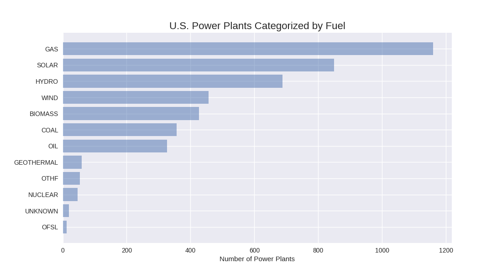

# US Power Plants NAIP/LANDSAT8 Dataset
This dataset is collection of 1,642 satellite imagery instances of US mainland power plants, providing both high resolution (1m) and medium resolution (15m) for detection/segmentation tasks. Data sources:
* [NAIP](https://www.fsa.usda.gov/programs-and-services/aerial-photography/imagery-programs/naip-imagery/) for high resolution imagery
* [Landsat8](https://landsat.usgs.gov/landsat-8) for medium-resolution imagery
* [EPA EGRID documents](https://www.epa.gov/energy/emissions-generation-resource-integrated-database-egrid) for latitude and longitude locations

## Data Facts and Explanations
Images naming convention: ```DataType_ID_StateName_PrimaryFuel.tif```<br/>
Annotations naming convention: ```LabelType_ID.png```
1. **/uspp_naip** (US Power Plants, NAIP Imagery)
  * High-resolution power plant images (1m/pixel, ~1115x1115 pix, ~5M/ea);
  * Used for gathering ground truth (outline of power plants) with human effort;
  * As a reference for any confusions that may appear in lower resolutions.
2. **/uspp_landsat** (US Power Plants, Landsat8 Imagery)
  * Medium-resolution power plant images (15m/pixel, ~75x75 pix, ~17K/ea);
  * To be used for machine learning practice.
3. **/annotations**
  * Contains 3 components:
    * All accepted annotations in JSON text file;
    * Binary masks denoting power plant borders;
    * Confidence maps denoting, at each pixel, the number of annotators who labeled it as part of a power plant;
  * By crowdsourcing (Amazon Mechanical Turk).
4. **/exceptions**
  * Images of "power plants" that are not visible at the documented location, or no annotations are approved;
  * To be automatically annotated by the algorithm developed using the approved images and annotations.
5. **uspp_metadata.geogson** (US Power Plant Metadata in Geographic Form)
  * Contains 8 components (1 geographic feature + 7 properties):
    * Geographic location in latitude and longitude
    * Unique Egrid ID
    * Plant name
    * State and county name
    * Primary fuel
    * Fossil fuel category
    * Capacity factor, nameplate capacity
    * CO<sub>2</sub> emission<br/>

## Data List by Fuel Category


\* Plant Primary Fuel Category (PLFUELCT) [1]
The fuel category for the primary fuel of the plant.
This field is “COAL” if the plant’s primary fuel is derived from coal ( fuel type = BIT, COG, LIG, RC, SGC, SUB, WC), “OIL” if it is derived from oil (DFO, JF, KER, PC, RFO, WO), “GAS” if it is derived from gas (BU, NG, PG), “OFSL” if it is another fossil fuel (BFG, OG, TDF), “NUCLEAR” if it is derived from nuclear (NUC), “HYDRO” if it is derived from hydro power (WAT), “SOLAR” if it is derived from solar power, (SUN), “WIND” if it is derived from wind power, ”GEOTHERMAL” if it is derived from geothermal power, “OTHF” if it is derived from waste heat/unknown/purchased DESCRIPTION OF DATA ELEMENTS Technical Support Document for eGRID2014 pg. 49 (MWH, OTH, PRG, PUR, WH), and “BIOMASS” if it is derived from biomass sources (AB, BLQ, LFG, MSW, OBG, OBL, OBS, SLW, WDL, WDS).   

Table 1 Fuel categories in this dataset

| Fuel Category |Description (the primary fuel is derived from)|Count |
| --------- |-------|---------|
|GAS|gas|1160|
|SOLAR|solar power|850|
|HYDRO|hydro power|688|
|WIND|wind power|457|
|BIOMASS|biomass sources|427|
|COAL|coal|357|
|OIL|oil|326|
|GEOTHERMAL|geothermal power|59|
|OTHF|waste heat/unknown/purchased |53|
|NUCLEAR|nuclear|46|
|UNKNOWN|not on the document|19|
|OFSL|another fossil fuel|12|
|__Total__|__-__|__4454__|

A total of 7068 annotation lines with valid egrid IDs were read,
4454 of which are valid power plants and thus processed, whereas the rest do not have qualified image or annotation at all and thus dumped into exceptions.

## More Explanations
> __Q: Why did you create this dataset?<br/>
> A:__ We are the Electricity Access Team from Duke Data+ Program. The ultimate goal of our project is to detect electricity access in developing countries from aerial imagery. To start with, we chose power plants as an indicator, as they 1) show definite electricity access, and 2) can be seen in moderate-resolution imagery.

> __Q: Now that you have a set of high-resolution imagery, why does this dataset have another set of exactly the same images with low resolution?<br/>
> A:__ Higher resolution is generally preferable, but the motivation of creating this dataset was to investigate the electricity access in developing countries. Unfortunately, the NAIP data is available only for the contiguous U.S., whereas the Landsat data is globally free which agrees with the scope of the future study.

> __Q: In that case, why is the limited-source imagery even here?<br/>
> A:__ Landsat's resolution is not human-friendly, where identifying power plants borders can be difficult. However, in high-resolution NAIP outlining power plants is very easy. So we gave NAIP imagery to people and asked them to draw bounding polygons on it. Then we could translate their annotations to the Landsat size and actually use them.

> __Q: How do you know that the annotations are accurate?<br/>
> A:__ Errors are basically inevitable in large datasets, but we tried our best to keep it as low as possible. This dataset is double insured: we 1) checked through all submissions, and rejected crazy ones; 2) asked multiple annotators to work on replicated images, and took the majority vote when merging into binary masks.

> __Q: How do I use this dataset?<br/>
> A:__ With all possibilities in data usage, we have previously tried image segmentation by pixel-based classification. In addition, it can also be used for multi-class training (e.g. classify by energy type) and deep learning problems (a natural fit for FCN implementation). Furthermore, the energy type, capacity and emission data may also be of interest to researchers in economics, statistics and environment.

> __Q: What if I want to use other imagery for power plant detection instead of Landsat?<br/>
> A:__ There are at least two ways to know where to look at if you plan to get your own data: 1) Our cropping was exactly centered at the coordinates in *uspp\_metadata.geogson*, with .005 degrees span. Using this information you can project the boxes back to any maps; 2) Alternatively, the NAIP data is in geotiff format from which you can extract longitude and latitude limits, allowing you to crop exactly the same regions from arbitrary data sources. For example, in MATLAB you can do:
> ```MATLAB
> info = geotiffinfo(NAME_OF_YOUR_GEOTIFF);
> latitude_limits = info.SpatialRef.LatitudeLimits
> longitude_limits = info.SpatialRef.LongitudeLimits```


For more information of the project and the dataset, please refer to [Electricity Access in Developing Countries](https://bigdata.duke.edu/projects/electricity-access-developing-countries-aerial-imagery) and [the creation of USPPDS](https://github.com/bl166/USPowerPlantDataset).

## References
[1] Fuel category descriptions: https://www.epa.gov/sites/production/files/2015-10/documents/egrid2012_technicalsupportdocument.pdf
